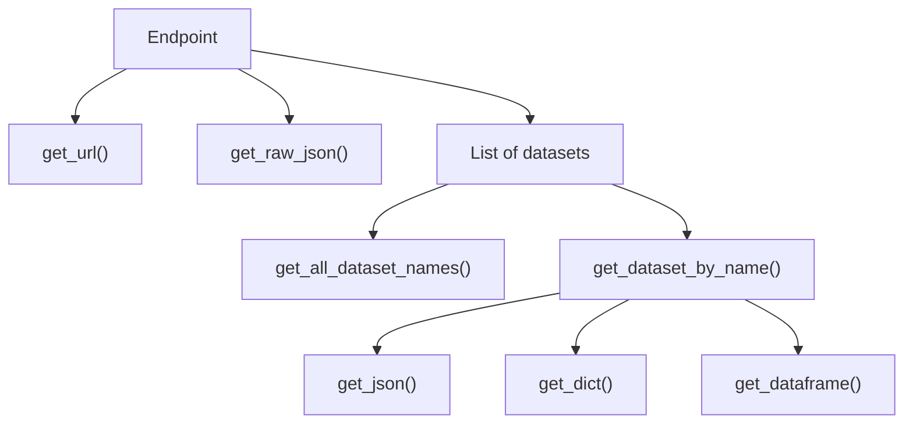

# Data Access

This section explains how to retrieve data from dynamic endpoints, access static resources such as player and team IDs, and use various configuration options to tailor your requests.

## **Package Structure**

This package is organized so that each endpoint returns a container of datasets. Depending on the endpoint, this container may include one or multiple datasets. A dataset is a logically grouped set of related data. For example, the TeamDepthChart endpoint returns three datasets: "OFFENSE", "DEFENSE", and "SPECIAL_TEAMS".

### **Accessing Endpoint Data**
To work with endpoint data:

1. Instantiate the endpoint.
2. Access the dataset by name.
3. Render the dataset using utility methods: `get_json()`, `get_dict()`, or `get_dataframe()`.


```python
# Call endpoint, which loads the dataset container
team_depth_chart = TeamDepthChart(team_id = 12) 

# Access the desired dataset 
offense = team_depth_chart.get_dataset_by_name("OFFENSE") 

 # Print out dataset in dataframe format 
print(offense.get_dataframe())
```

You can also chain the above functions. 

```python
TeamDepthChart(team_id = 12).get_dataset_by_name("OFFENSE").get_dataframe()
```

To list all available dataset names returned by an endpoint:

```python
TeamDepthChart(team_id = 12).get_all_dataset_names() 
# OUTPUT: ["OFFENSE", "DEFENSE", "SPECIAL_TEAMS"]
```




!!! Note
    The list of datasets (internally) is stored as a dictionary mapping of the dataset name to its associated data.


### **Raw Data & URLs**

This package parses the raw JSON returned from ESPN's API endpoints into a well-formed response. A large chunk of each raw response is thrown away by these parsers for brevity/relevancy. However, if you would like to access the raw JSON that is returned, you can use `get_raw_json()` on the endpoint object. 


```python
PlayerCareerStats(player_id = 3139477).get_raw_json() 
# OUTPUT: Big JSON load
```

### **Inspecting Request URL** 

If you would like to access the exact URL that the request is being made to, you can also access `get_url()` on the endpoint object.  
You can copy-paste this URL into your browser or a cURL client such as Postman to inspect the raw response. 


```python
PlayerCareerStats(player_id = 3139477).get_url() 

# OUTPUT: "https://site.web.api.espn.com/apis/common/v3/sports/football..."
```

## **Player Data**

Some endpoints require ESPN player IDs. The package provides utilities to look up and search for players.

`nfl_api_client.lib.data` stores an exhaustive list of all player names alongwith their associated IDs. You can use the functions shown below to filter and search through the players based on their name, ID, or active/inactive status. 


```python
from nfl_api_client.static.players import (
    get_players,
    find_player_by_id,
    find_players_by_full_name,
    find_players_by_first_name,
    find_players_by_last_name,
)

from nfl_api_client.lib.data import players

# Get all player entries with ID, name, and active status
all_players = get_players()
print(all_players[:5])  # Preview the first 5 players, but each player is an object

# Find a player by their unique ESPN player ID
player = find_player_by_id("2976316")
print(player)

# Search players by full name (case-insensitive, accent-insensitive)
matching = find_players_by_full_name("Mahomes")
print(matching)

# Search players by last name using regex (e.g. names starting with "Mc")
mc_players = find_players_by_last_name(r"^Mc")
print(mc_players)

# You can also search by first name
first_name_matches = find_players_by_first_name("Josh")
print(first_name_matches)

# Combine with your own filtering logic
active_macks = [p for p in find_players_by_last_name("Mack") if p["is_active"]]
print(active_macks)

```

## **Parameters**

Certain endpoints (like TeamRoster) require an ESPN team ID. These can be passed in two ways:

- As a raw integer
- Using the provided TeamID Enum for clarity

This applies for other endpoints that require a specific Season Type or Conference ID. You can get more clarification on which entities have which IDs by looking at the [Parameters](parameters.md) section for more information. 


```python
from nfl_api_client.endpoints.team_roster import TeamRoster
from nfl_api_client.lib.parameters import TeamID

# Option 1: Use raw ESPN team ID (integer)
roster_raw_id = TeamRoster(team_id=24)  # Los Angeles Chargers
print(roster_raw_id.get_raw_json())

# Option 2: Use provided Enum for clarity and readability
roster_enum = TeamRoster(team_id=TeamID.LAC)
print(roster_enum.get_raw_json())
```
