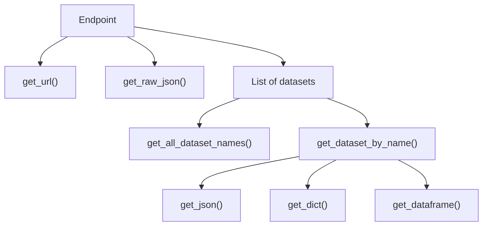

# Data Access

This section touches on how to access data from various dynamic endpoints, how to access static data (such as player IDs, names),team IDs, and other IDs pertinent to the requests. 

## Package Structure

The package is structured such that each endpoint returns a container of datasets. Depending on the nature of the endpoint, this container may hold either one or multiple different datasets. A dataset in this context is a related grouping of data. For example, a team will have 3 different datasets for its depth chart - Offense, Defense, and Special Teams. 

To access the individual datasets, you must first get the particular dataset by name. 

Then, there are 3 utility functions to render the data in your desired format - `get_json()`, `get_dict()`, and `get_dataframe()`. 


```python
# Call endpoint, which loads the dataset container
team_depth_chart = TeamDepthChart(team_id = 12) 

# Access the desired dataset 
offense = team_depth_chart.get_dataset_by_name("OFFENSE") 

 # Print out dataset in dataframe format 
print(offense.get_dataframe())
```

Conversely, you can also chain the above functions. 

```python
TeamDepthChart(team_id = 12).get_dataset_by_name("OFFENSE").get_dataframe()
```

The documentation for each endpoint is structured such that it lists all available datasets under that endpoint, and the individual headers/columns/keys in the returned data. 

You can also view all available dataset names inside a container by using `get_all_dataset_names()` on the particular endpoint object. 
For example, 

```python
TeamDepthChart(team_id = 12).get_all_dataset_names() 
# OUTPUT: ["OFFENSE", "DEFENSE", "SPECIAL_TEAMS"]
```




!!! Note
    The list of datasets (internally) is actually stored as a dictionary mapping of the dataset name to its associated data.


### Raw ESPN JSON 
This package parses the JSON data returned from ESPN's API endpoints into a well-formed response. A large chunk of each returned response is thrown away by these parsers for lack of relevancy. However, if you would like to access the raw JSON that is returned, you can use `get_raw_json()` at the endpoint level. 


```python
PlayerCareerStats(player_id = 3139477).get_raw_json() 
# OUTPUT: Big JSON load
```

### ESPN API Request URL 

If you would like to access the exact URL that the request is being made to, you can also access `get_url()` at the endpoint level. 
This will return a string of the URL with the query and path parameters embedded. You can copy-paste this URL into your browser or a cURL client such as Postman to inspect the response. 


```python
PlayerCareerStats(player_id = 3139477).get_url() 

# OUTPUT: "https://site.web.api.espn.com/apis/common/v3/sports/football..."
```

## Player Data

Many endpoints rely on providing specific NFL player IDs. ESPN maintains its own mapping of player to player IDs. You can access the list of player IDs using package.


This returns a list of players with their player ID, names, and active status. You also have the ability of filtering out players by searching for names or searching by active. Regex functionality is also supported. 

```python
from nfl_api_client.static.players import (
    get_players,
    find_player_by_id,
    find_players_by_full_name,
    find_players_by_first_name,
    find_players_by_last_name,
)

# Get all player entries with ID, name, and active status
all_players = get_players()
print(all_players[:5])  # Preview the first 5 players, but each player is an object

# Find a player by their unique ESPN player ID
player = find_player_by_id("2976316")
print(player)

# Search players by full name (case-insensitive, accent-insensitive)
matching = find_players_by_full_name("Mahomes")
print(matching)

# Search players by last name using regex (e.g. names starting with "Mc")
mc_players = find_players_by_last_name(r"^Mc")
print(mc_players)

# You can also search by first name
first_name_matches = find_players_by_first_name("Josh")
print(first_name_matches)

# Combine with your own filtering logic
active_macks = [p for p in find_players_by_last_name("Mack") if p["is_active"]]
print(active_macks)


```

## Parameters

Certain endpoints, such as team roster, require providing an ESPN team ID. To make access easy, you can see Reference > Parameters for the mapping of team codes to IDs. Under the hood, each ID is an integer. For endpoints that require such IDs, you can either directly inject the integer ID of the team, or you can make use of the provided Enum. 

```python
from nfl_api_client.endpoints.team_roster import TeamRoster
from nfl_api_client.lib.parameters import TeamID

# Option 1: Use raw ESPN team ID (integer)
roster_raw_id = TeamRoster(team_id=24)  # Los Angeles Chargers
print(roster_raw_id.get_raw_json())

# Option 2: Use provided Enum for clarity and readability
roster_enum = TeamRoster(team_id=TeamID.LAC)
print(roster_enum.get_raw_json())
```


You can also do the same with other types of ID Enums in `nfl_api_client.lib.parameters`.